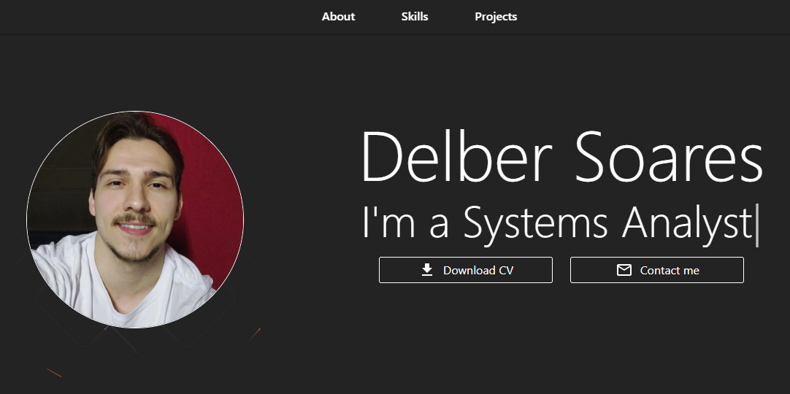

# 🌐 My Portfolio

<p align="center">
  
</p>


> Um portfólio moderno e responsivo desenvolvido com **React**, **TypeScript** e **Material UI**, destacando meus projetos, habilidades e informações de contato.

🔗 **Acesse online:** [delber-portfolio.vercel.app](https://delber-portfolio.vercel.app)

---

## 🚀 Tecnologias Utilizadas

Este projeto foi construído com as seguintes tecnologias:

- ⚛️ [React 19](https://react.dev/)
- 💎 [TypeScript](https://www.typescriptlang.org/)
- 🎨 [Material UI](https://mui.com/)
- 💅 [Emotion Styled Components](https://emotion.sh/docs/styled)
- 🧠 [React Icons](https://react-icons.github.io/react-icons/)
- ⌨️ [React Typed](https://www.npmjs.com/package/react-typed)
- ⚡ [Vite](https://vitejs.dev/) — para desenvolvimento rápido

---
## 📁 Estrutura do Projeto
```
my-portfolio/
│
├── public/
│ └── images/ # Imagens públicas
│ └── curriculum
├── src/
│ ├── assets/ # Imagens e ícones internos
│ ├── components/ # Componentes reutilizáveis
│ │ ├── AnimatedBackground/
│ │ ├── AnimationComponent/
│ │ ├── NavBar/
│ │ ├── ProjectCard/
│ │ └── StyledButton/
│ │
│ ├── pages/Home/sections/ # Seções da página principal
│ │ ├── AboutSection/
│ │ ├── Hero/
│ │ ├── ProjectsSection/
│ │ ├── SkillsSection/
│ │ └── FooterSection/
│ │
│ ├── pages/Home/ # Página principal
│ ├── utils/ # Utilitários e helpers
│ ├── theme.ts # Tema global (Material UI)
│ ├── App.tsx
│ └── main.tsx
│
├── .gitignore
├── package.json
├── tsconfig.json
└── README.md
```

---

## 🖥️ Como Rodar Localmente

### 1️⃣ Clone o repositório

```bash
git clone https://github.com/delberss/my-portfolio.git
```
### 2️⃣ Acesse a pasta do projeto
```bash
cd my-portfolio
```
### 3️⃣ Instale as dependências

```bash
npm install
```
### 4️⃣ Execute o projeto
```bash
npm run dev
```
### 5️⃣ Abra no navegador
```bash
http://localhost:5173
```